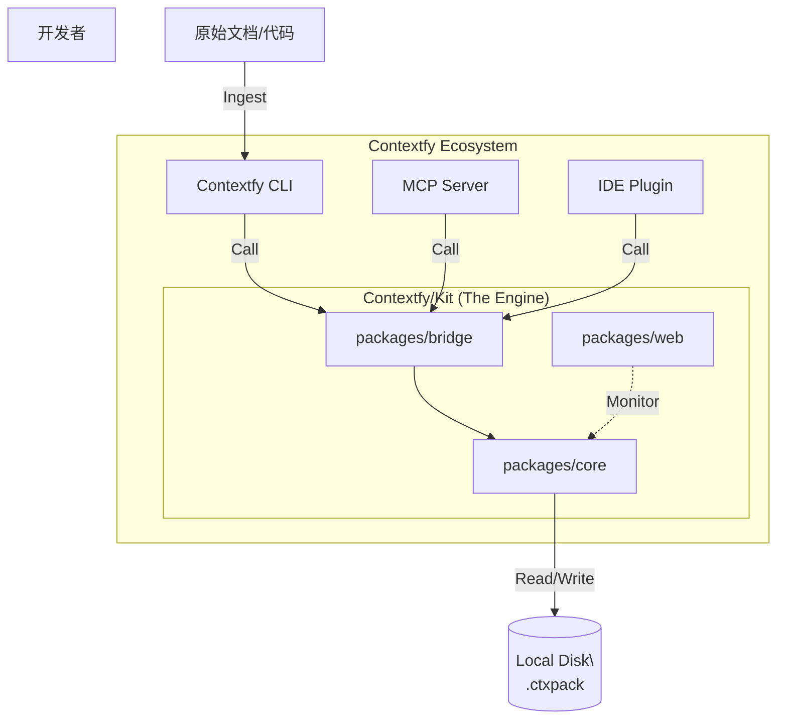
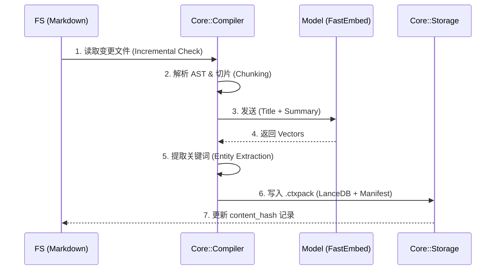
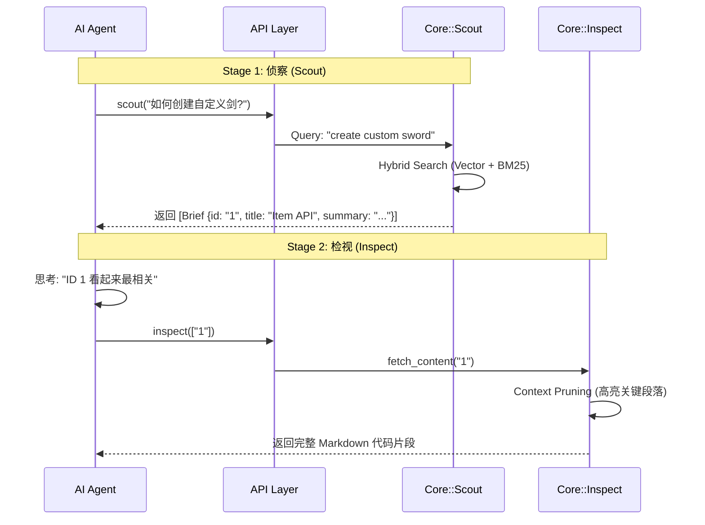

# Contextfy/Kit 系统架构设计文档 (Architecture Document)

| 属性 | 内容 |
| --- | --- |
| **项目名称** | Contextfy/Kit |
| **版本** | v1.0.0 (Architecture Draft) |
| **状态** | 待评审 |
| **技术栈** | Rust (Core), LanceDB (Vector), Next.js (UI), NAPI-RS/PyO3 (Bridge) |

---

## 1. 架构原则 (Architectural Principles)

在设计 Kit 时，我们遵循以下核心工程原则：

1. **无头优先 (Headless First):** 核心逻辑必须与表现层（CLI/Web/MCP）完全解耦。Core Crate 不应包含任何 UI 代码。
2. **零拷贝读取 (Zero-Copy Read):** 利用 LanceDB 和 Arrow 格式特性，在检索时尽量减少内存复制，确保在低端设备上的高性能。
3. **故障隔离 (Fault Isolation):** 一个 Context Pack 的损坏或解析失败，不应导致整个引擎崩溃（Panic Safe）。
4. **可观测性内建 (Observability Built-in):** 检索链路必须暴露 Trace ID 和详细的打分日志，而非仅返回结果。

---

## 2. 系统上下文视图 (System Context View)

这是 Kit 在生态系统中的位置。Kit 是一个 **Library + Daemon**。



---

## 3. 容器视图与模块设计 (Container View)

我们将 Monorepo 拆分为以下核心 Crates (Rust Packages)：

### 3.1 `packages/core` (The Brain)

无依赖的纯 Rust 库，负责业务逻辑。

- **`compiler` 模块:**
- **MarkdownParser:** 基于 `pulldown-cmark`，负责 AST 解析。
- **Chunker:** 实现语义切片策略（按 Header、按代码块）。
- **Summarizer:** 提取用于 Scout 阶段的摘要（首段截取或 LLM 总结接口）。
- **`storage` 模块:**
- **LanceManager:** 封装 LanceDB 的读写操作。
- **PackManager:** 管理 Context Pack 的生命周期（加载、卸载、版本检查）。
- **`retriever` 模块:**
- **HybridSearcher:** 协调 Vector Search (LanceDB) 和 Keyword Search (BM25/Tantivy)。
- **ReRanker:** 根据元数据权重对结果进行重排序。

### 3.2 `packages/bridge` (The Glue)

负责 FFI (Foreign Function Interface) 绑定。

- **`ffi_node`:** 使用 `napi-rs` 暴露给 Node.js 环境。
- **`ffi_py`:** 使用 `pyo3` 暴露给 Python 环境。
- **Struct Mapper:** 负责将 Rust 的 `struct` 高效转换为 JS Object / Python Dict。

### 3.3 `packages/server` (The Host)

虽然 Kit 是库，但 Web UI 需要一个后端宿主。

- **Axum Server:** 提供本地 localhost API。
- **WebSocket:** 实时推送索引进度和 Log。

---

## 4. 关键流程架构 (Key Process Flows)

### 4.1 编译管线 (The Compilation Pipeline)

这是将“死文档”变为“活知识”的过程。



### 4.2 两阶段检索 (Two-Stage Retrieval)

这是解决 Token 浪费和提升准确率的核心路径。



---

## 5. 数据架构设计 (Data Architecture)

### 5.1 物理存储结构 (On-Disk Structure)

每个 Context Pack 是一个独立的文件夹，实现了物理隔离。

```
~/.contextfy/packs/
├── fabric-1.21/              # Namespace: fabric-1.21
│   ├── manifest.json         # 元数据 (Version, Source Config)
│   ├── .lock                 # 写入锁
│   ├── index/                # LanceDB 数据目录
│   │   ├── data.lance/       # 向量与正文数据
│   │   └── _transactions/    # MVCC 事务日志
│   └── cache/                # 增量编译的 Hash 缓存
└── std-lib/                  # Namespace: std-lib
    └── ...
```

### 5.2 LanceDB Schema 定义

我们使用单一宽表设计，通过 Column Projection 优化读取性能。

```rust
// Rust Struct 映射
struct KnowledgeRecord {
    id: String,             // UUID
    doc_path: String,       // 原始文件路径 (用于追溯)

    // Scout 阶段读取的列
    title: String,
    summary: String,        // 纯文本摘要
    tags: Vec<String>,      // 关键词/API名

    // Inspect 阶段读取的列 (通常只在 Scout 命中后加载)
    content: String,        // 完整 Markdown/代码

    // 索引列
    vector: Vec<f32>,       // Embedding(title + summary)
}
```

---

## 6. 接口设计 (Interface Design)

### 6.1 Rust Trait 定义 (`packages/core/src/traits.rs`)

```rust
#[async_trait]
pub trait KnowledgeBase {
    /// 侦察模式：低延迟，仅返回元数据
    async fn scout(&self, query: &str, options: SearchOptions) -> Result<Vec<ScoutResult>>;

    /// 检视模式：读取完整内容
    async fn inspect(&self, ids: &[String]) -> Result<Vec<InspectResult>>;

    /// 获取调试信息 (X-Ray)
    async fn explain(&self, query: &str, doc_id: &str) -> Result<Explanation>;
}

pub struct SearchOptions {
    pub limit: usize,
    pub min_score: f32,
    pub strategies: Vec<Strategy>, // [Vector, Keyword]
}

```

### 6.2 FFI 暴露 (Binding Layer)

对外暴露的 API 必须是 C-compatible 或通过 NAPI/PyO3 封装。

- **Node.js:** `const results = await kit.scout("query", { limit: 5 });`
- **Python:** `results = kit.scout("query", limit=5)`

---

## 7. 关键技术决策与权衡 (Trade-offs)

| 决策点 | 选项 | 最终选择 | 理由 |
| --- | --- | --- | --- |
| **嵌入模型** | API 调用 (OpenAI) vs 本地模型 | **本地 (FastEmbed)** | 保证离线可用，速度快，无额外成本。ONNX 运行时直接集成在 Rust 中。 |
| **全文检索** | Elasticsearch vs Tantivy vs LanceDB | **LanceDB (Vector) + Tantivy (Keyword)** | LanceDB 虽支持 FTS 但目前较弱。Tantivy 是 Rust 生态最好的 FTS 库，适合精确关键词匹配。 |
| **GUI 框架** | Electron vs Tauri | **Next.js + Tauri (或纯 Web)** | 考虑到 Web UI 主要是 Dashboard，不需要深度系统集成。为了开发效率，前端使用 Next.js，后端通过 localhost 通信，或者 Tauri 包裹。 |
| **并发模型** | Thread-per-request vs Async | **Tokio Async** | I/O 密集型操作（读文件、读 DB），Async 是 Rust 的标准解法。 |

---

## 8. 可观测性设计 (Observability)

为了实现 "X-Ray" 面板，Core 必须维护一个短暂的 **Session State**。

- **Trace Context:** 每次 `scout` 请求生成一个 `request_id`。
- **Debug Log:** 记录每一步的耗时、召回数量、过滤原因。
- **Explain Interface:** 当用户在 UI 点击“为什么这个排第一”时，调用 `explain` 接口，返回：
    - Vector Distance (向量距离)
    - BM25 Score (关键词得分)
    - Decay Factor (如果有时间衰减)

---

## 9. 安全性考量 (Security)

1. **路径遍历 (Path Traversal):** 编译器必须严格限制只能读取 `manifest.json` 中定义的 `root` 目录下的文件。
2. **资源限制:** 限制 LanceDB 的内存映射大小，防止 OOM。
3. **本地沙箱:** 既然是 Local-First，不上传数据，但需防止恶意构造的 Markdown 导致解析器崩溃（DoS）。

---
