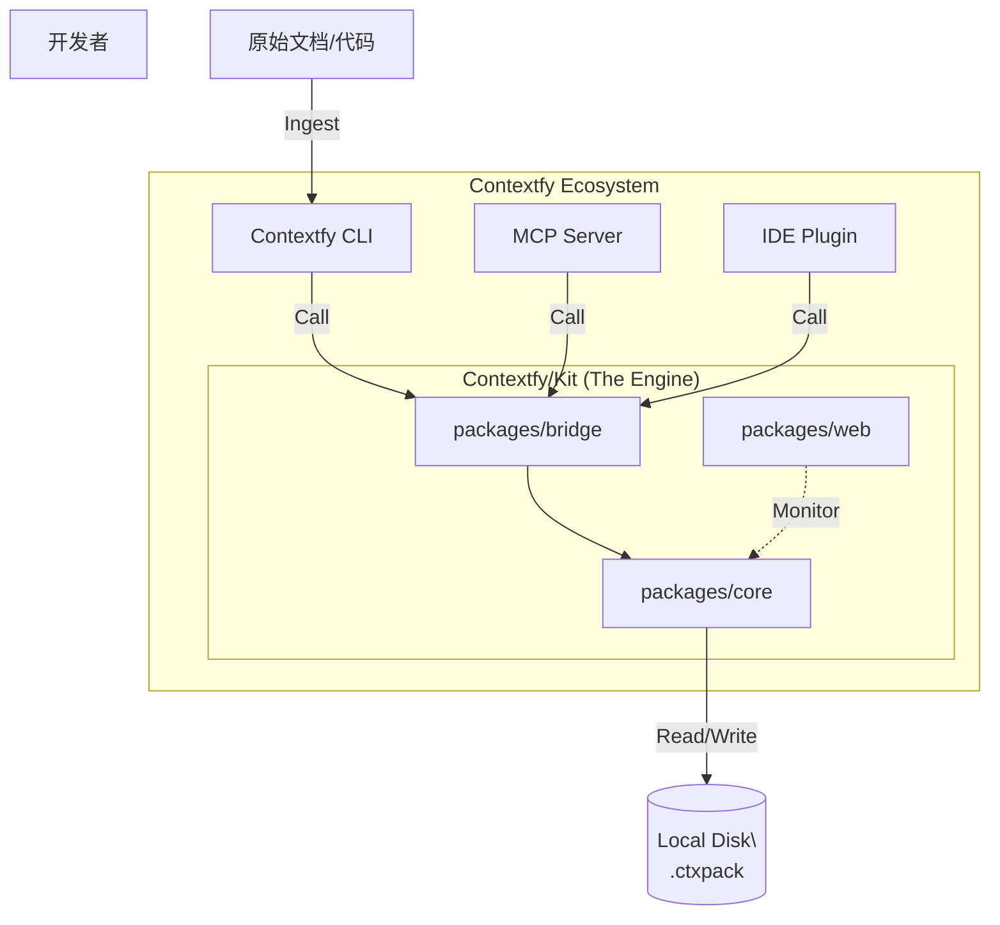
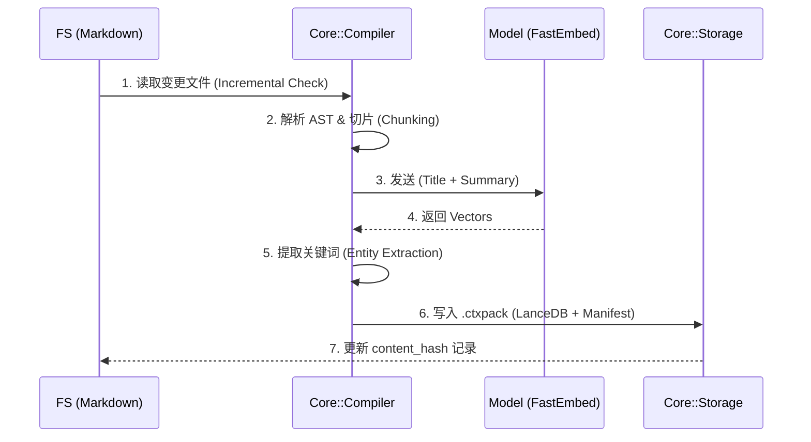
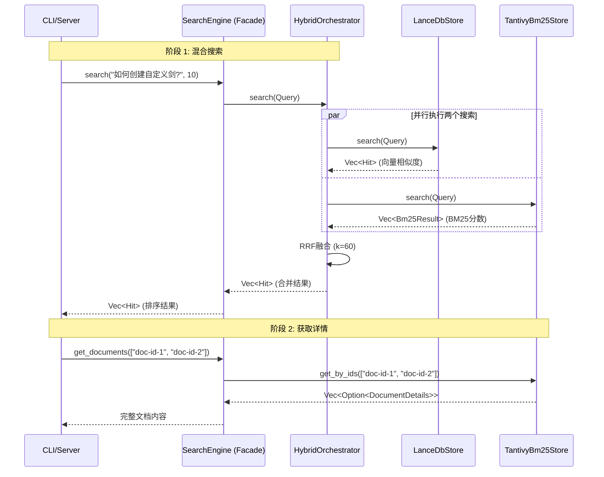

# Contextfy/Kit 系统架构设计文档 (Architecture Document)

| 属性 | 内容 |
| --- | --- |
| **项目名称** | Contextfy/Kit |
| **版本** | v1.0.0 (Architecture Draft) |
| **状态** | 待评审 |
| **技术栈** | Rust (Core), LanceDB (Vector), Next.js (UI), NAPI-RS/PyO3 (Bridge) |

---

## 1. 架构原则 (Architectural Principles)

在设计 Kit 时，我们遵循以下核心工程原则：

1. **无头优先 (Headless First):** 核心逻辑必须与表现层（CLI/Web/MCP）完全解耦。Core Crate 不应包含任何 UI 代码。
2. **零拷贝读取 (Zero-Copy Read):** 利用 LanceDB 和 Arrow 格式特性，在检索时尽量减少内存复制，确保在低端设备上的高性能。
3. **故障隔离 (Fault Isolation):** 一个 Context Pack 的损坏或解析失败，不应导致整个引擎崩溃（Panic Safe）。
4. **可观测性内建 (Observability Built-in):** 检索链路必须暴露 Trace ID 和详细的打分日志，而非仅返回结果。

---

## 2. 系统上下文视图 (System Context View)

这是 Kit 在生态系统中的位置。Kit 是一个 **Library + Daemon**。


```mermaid
graph TD
    UserDev[开发者]
    Docs[原始文档/代码]

    subgraph "Contextfy Ecosystem"
        CLI[Contextfy CLI]
        MCP[MCP Server]
        VSCode[IDE Plugin]

        subgraph "Contextfy/Kit (The Engine)"
            Core[packages/core]
            Bridge[packages/bridge]
            Web[packages/web]
        end
    end

    Docs -->|Ingest| CLI
    CLI -->|Call| Bridge
    MCP -->|Call| Bridge
    VSCode -->|Call| Bridge

    Bridge --> Core
    Web -.->|Monitor| Core

    Core -->|Read/Write| Storage[(Local Disk\\n.ctxpack)]

```

---

## 3. 容器视图与模块设计 (Container View)

我们将 Monorepo 拆分为以下核心 Crates (Rust Packages)：

### 3.1 `packages/core` (The Brain)

无依赖的纯 Rust 库，负责业务逻辑。

#### 三层存储架构 (Three-Tier Storage Architecture)

```
┌─────────────────────────────────────────────┐
│         Facade Layer (SearchEngine)          │
│  - search(query_text, limit)                │
│  - add(id, title, summary, content, keywords)│
│  - get_document(id)                         │
└──────────────────┬──────────────────────────┘
                   │
                   ▼
┌─────────────────────────────────────────────┐
│      Orchestrator Layer (HybridOrchestrator) │
│  - 并行执行 BM25 + 向量搜索                 │
│  - RRF (Reciprocal Rank Fusion) 结果合并    │
│  - 优雅的错误降级                           │
└────────┬──────────────────────┬─────────────┘
         │                      │
    ▼    │                      ▼
┌──────────────┐        ┌──────────────┐
│ LanceDbStore │        │TantivyBm25Store│
│  (向量搜索)  │        │  (BM25搜索)   │
└──────────────┘        └──────────────┘
```

##### Facade Layer: SearchEngine

对外提供的极简高级接口，隐藏内部复杂性。

**核心 API:**
- `search(query_text, limit)` → 返回混合检索结果
- `add(id, title, summary, content, keywords)` → 添加文档到两个存储
- `get_document(id)` → 获取单个文档详情
- `get_documents(ids)` → 批量获取文档
- `delete(id)` → 删除文档（返回详细结果）

**特点:**
- 单例 EmbeddingModel 管理（共享 BGE-small-en 模型）
- 自动初始化 LanceDB 和 Tantivy 后端
- 完全向后兼容的 API 设计

##### Orchestrator Layer: HybridOrchestrator

混合检索编排器，协调多个存储后端。

**核心特性:**
- **并行执行**: 使用 `tokio::join!` 同时执行 BM25 和向量搜索
- **RRF 融合**: 使用倒数排名融合算法（k=60）合并结果
- **错误降级**: 单个后端失败时自动降级到另一个

**RRF 算法:**
```text
score(d) = Σ 1 / (k + rank_i(d))

其中：
- d 是文档
- rank_i(d) 是文档在方法 i 中的排名（1-indexed）
- k 是常数（默认 60）
```

##### Storage Layer: 双存储后端

**LanceDbStore (向量存储)**
- 使用 LanceDB 存储向量嵌入（384 维，BGE-small-en）
- 支持语义相似度搜索（L2 距离）
- Schema: `{id, title, summary, content, vector, keywords, source_path}`

**TantivyBm25Store (全文存储)**
- 使用 Tantivy 索引实现 BM25 全文搜索
- 支持中文分词（Jieba）
- 关键词字段权重提升（5.0-10.0）
- 返回完整文档详情（title, summary, content）

#### 核心模块

- **`parser` 模块:**
  - **MarkdownParser:** 基于 `pulldown-cmark`，负责 AST 解析。
  - **SemanticChunker:** 实现语义切片策略（按 H2 Header）。
  - **SummaryExtractor:** 提取文档摘要（首段或代码块）。

- **`embeddings` 模块:**
  - **EmbeddingModel:** 封装 FastEmbed，生成 384 维向量。
  - **单例模式:** 全局共享模型实例，避免重复加载。

- **`bridge` 模块:**
  - **BridgeApi:** 提供 FFI 安全接口（Node.js/Python）。
  - **错误映射:** 将 Rust 错误转换为跨语言兼容格式。

### 3.2 `packages/bridge` (The Glue)

负责 FFI (Foreign Function Interface) 绑定。

- **`ffi_node`:** 使用 `napi-rs` 暴露给 Node.js 环境。
- **`ffi_py`:** 使用 `pyo3` 暴露给 Python 环境。
- **Struct Mapper:** 负责将 Rust 的 `struct` 高效转换为 JS Object / Python Dict。

### 3.3 `packages/server` (The Host)

虽然 Kit 是库，但 Web UI 需要一个后端宿主。

- **Axum Server:** 提供本地 localhost API。
- **WebSocket:** 实时推送索引进度和 Log。

---

## 4. 关键流程架构 (Key Process Flows)

### 4.1 编译管线 (The Compilation Pipeline)

这是将“死文档”变为“活知识”的过程。


```mermaid
sequenceDiagram
    participant Source as FS (Markdown)
    participant Compiler as Core::Compiler
    participant Embedder as Model (FastEmbed)
    participant Store as Core::Storage

    Source->>Compiler: 1. 读取变更文件 (Incremental Check)
    Compiler->>Compiler: 2. 解析 AST & 切片 (Chunking)
    Compiler->>Embedder: 3. 发送 (Title + Summary)
    Embedder-->>Compiler: 4. 返回 Vectors
    Compiler->>Compiler: 5. 提取关键词 (Entity Extraction)
    Compiler->>Store: 6. 写入 .ctxpack (LanceDB + Manifest)
    Store-->>Source: 7. 更新 content_hash 记录

```

### 4.2 混合检索流程 (Hybrid Retrieval Flow)

系统原生使用混合检索架构，无需手动切换模式。这是解决 Token 浪费和提升准确率的核心路径。


```mermaid
sequenceDiagram
    participant Client as CLI/Server
    participant SearchEngine as SearchEngine (Facade)
    participant Orchestrator as HybridOrchestrator
    participant Vector as LanceDbStore
    participant BM25 as TantivyBm25Store

    Note over Client, Orchestrator: 阶段 1: 混合搜索
    Client->>SearchEngine: search("如何创建自定义剑?", 10)
    SearchEngine->>Orchestrator: search(Query)

    par 并行执行两个搜索
        Orchestrator->>Vector: search(Query)
        Vector-->>Orchestrator: Vec<Hit> (向量相似度)
    and
        Orchestrator->>BM25: search(Query)
        BM25-->>Orchestrator: Vec<Bm25Result> (BM25分数)
    end

    Orchestrator->>Orchestrator: RRF融合 (k=60)
    Orchestrator-->>SearchEngine: Vec<Hit> (合并结果)
    SearchEngine-->>Client: Vec<Hit> (排序结果)

    Note over Client, BM25: 阶段 2: 获取详情
    Client->>SearchEngine: get_documents(["doc-id-1", "doc-id-2"])
    SearchEngine->>BM25: get_by_ids(["doc-id-1", "doc-id-2"])
    BM25-->>SearchEngine: Vec<Option<DocumentDetails>>
    SearchEngine-->>Client: 完整文档内容
```

**关键特性:**

1. **并行搜索**: BM25 和向量搜索同时执行，延迟 ≈ `max(BM25延迟, 向量延迟)`
2. **RRF 融合**: 无需分数归一化，直接基于排名融合
3. **优雅降级**: 单个后端失败时自动使用另一个
4. **批量获取**: `get_documents()` 支持批量获取，减少网络往返

---

## 5. 数据架构设计 (Data Architecture)

### 5.1 物理存储结构 (On-Disk Structure)

系统使用双存储架构：LanceDB (向量) + Tantivy (全文)。

```
.contextfy/
├── data/
│   ├── lancedb/              # LanceDB 向量数据库
│   │   ├── knowledge.lance/  # 向量与正文数据 (Arrow格式)
│   │   └── _transactions/    # LanceDB MVCC 事务日志
│   └── bm25_index/           # Tantivy 全文索引
│       ├── meta.json         # 索引元数据
│       ├── .manageable/      # 可变段 (增量索引)
│       └── immutable/        # 不可变段 (已合并段)
└── cache.json                # 旧数据备份 (迁移后可删除)
```

**存储特性对比:**

| 特性 | LanceDB (向量) | Tantivy (BM25) |
|------|----------------|----------------|
| **用途** | 语义相似度搜索 | 关键词全文搜索 |
| **数据格式** | Arrow (列式) | 自有倒排索引 |
| **向量维度** | 384 (BGE-small-en) | N/A |
| **支持语言** | 跨语言 | Rust 原生 |
| **索引大小** | 较大 (~1KB/doc) | 较小 (~0.5KB/doc) |
| **查询延迟** | ~50-100ms | ~10-50ms |
| **并发模型** | MVCC | 读锁/写锁 |

