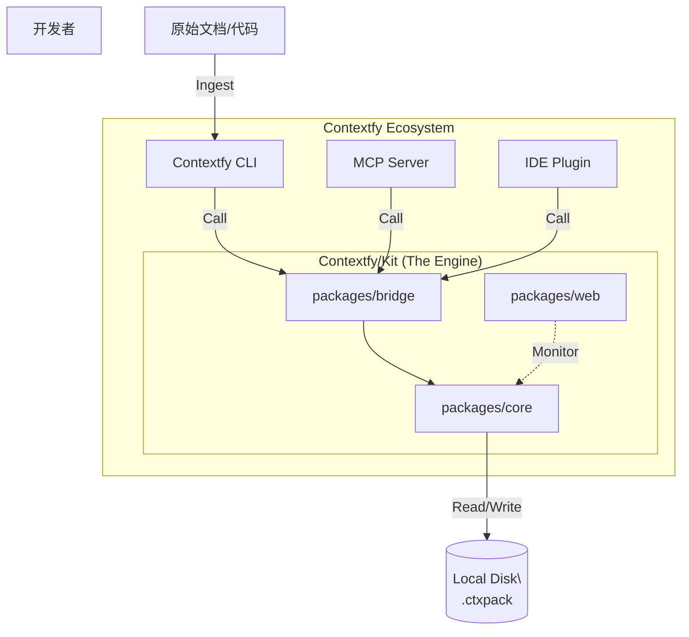
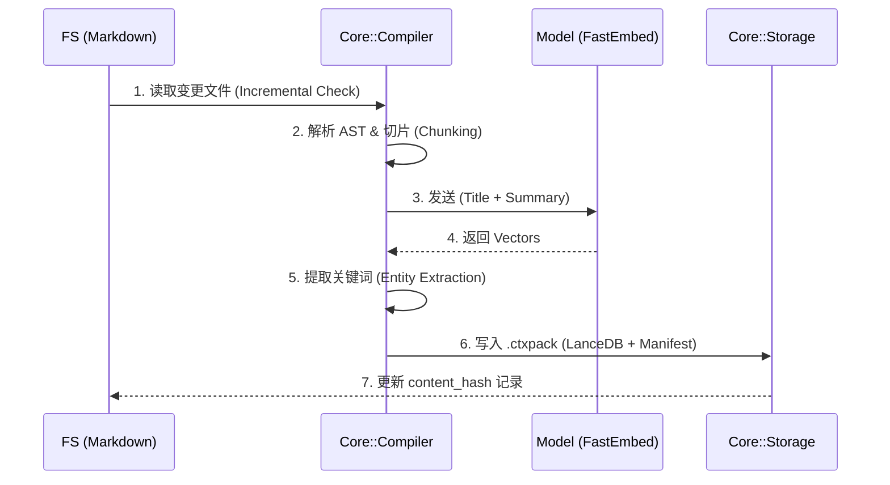
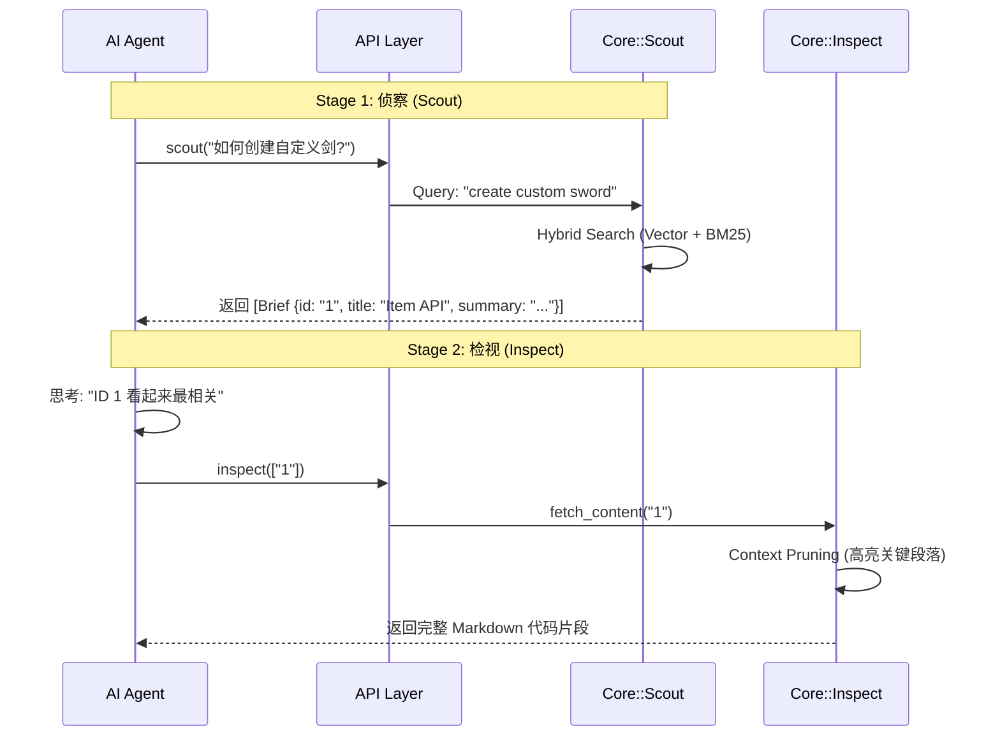

# Contextfy/Kit 系统架构设计文档 (Architecture Document)

| 属性 | 内容 |
| --- | --- |
| **项目名称** | Contextfy/Kit |
| **版本** | v1.0.0 (Architecture Draft) |
| **状态** | 待评审 |
| **技术栈** | Rust (Core), LanceDB (Vector), Next.js (UI), NAPI-RS/PyO3 (Bridge) |

---

## 1. 架构原则 (Architectural Principles)

在设计 Kit 时，我们遵循以下核心工程原则：

1. **无头优先 (Headless First):** 核心逻辑必须与表现层（CLI/Web/MCP）完全解耦。Core Crate 不应包含任何 UI 代码。
2. **零拷贝读取 (Zero-Copy Read):** 利用 LanceDB 和 Arrow 格式特性，在检索时尽量减少内存复制，确保在低端设备上的高性能。
3. **故障隔离 (Fault Isolation):** 一个 Context Pack 的损坏或解析失败，不应导致整个引擎崩溃（Panic Safe）。
4. **可观测性内建 (Observability Built-in):** 检索链路必须暴露 Trace ID 和详细的打分日志，而非仅返回结果。

---

## 2. 系统上下文视图 (System Context View)

这是 Kit 在生态系统中的位置。Kit 是一个 **Library + Daemon**。


```mermaid
graph TD
    UserDev[开发者]
    Docs[原始文档/代码]

    subgraph "Contextfy Ecosystem"
        CLI[Contextfy CLI]
        MCP[MCP Server]
        VSCode[IDE Plugin]

        subgraph "Contextfy/Kit (The Engine)"
            Core[packages/core]
            Bridge[packages/bridge]
            Web[packages/web]
        end
    end

    Docs -->|Ingest| CLI
    CLI -->|Call| Bridge
    MCP -->|Call| Bridge
    VSCode -->|Call| Bridge

    Bridge --> Core
    Web -.->|Monitor| Core

    Core -->|Read/Write| Storage[(Local Disk\\n.ctxpack)]

```

---

## 3. 容器视图与模块设计 (Container View)

我们将 Monorepo 拆分为以下核心 Crates (Rust Packages)：

### 3.1 `packages/core` (The Brain)

无依赖的纯 Rust 库，负责业务逻辑。

- **`compiler` 模块:**
- **MarkdownParser:** 基于 `pulldown-cmark`，负责 AST 解析。
- **Chunker:** 实现语义切片策略（按 Header、按代码块）。
- **Summarizer:** 提取用于 Scout 阶段的摘要（首段截取或 LLM 总结接口）。
- **`storage` 模块:**
- **LanceManager:** 封装 LanceDB 的读写操作。
- **PackManager:** 管理 Context Pack 的生命周期（加载、卸载、版本检查）。
- **`retriever` 模块:**
- **HybridSearcher:** 协调 Vector Search (LanceDB) 和 Keyword Search (BM25/Tantivy)。
- **ReRanker:** 根据元数据权重对结果进行重排序。

### 3.2 `packages/bridge` (The Glue)

负责 FFI (Foreign Function Interface) 绑定。

- **`ffi_node`:** 使用 `napi-rs` 暴露给 Node.js 环境。
- **`ffi_py`:** 使用 `pyo3` 暴露给 Python 环境。
- **Struct Mapper:** 负责将 Rust 的 `struct` 高效转换为 JS Object / Python Dict。

### 3.3 `packages/server` (The Host)

虽然 Kit 是库，但 Web UI 需要一个后端宿主。

- **Axum Server:** 提供本地 localhost API。
- **WebSocket:** 实时推送索引进度和 Log。

---

## 4. 关键流程架构 (Key Process Flows)

### 4.1 编译管线 (The Compilation Pipeline)

这是将“死文档”变为“活知识”的过程。


```mermaid
sequenceDiagram
    participant Source as FS (Markdown)
    participant Compiler as Core::Compiler
    participant Embedder as Model (FastEmbed)
    participant Store as Core::Storage

    Source->>Compiler: 1. 读取变更文件 (Incremental Check)
    Compiler->>Compiler: 2. 解析 AST & 切片 (Chunking)
    Compiler->>Embedder: 3. 发送 (Title + Summary)
    Embedder-->>Compiler: 4. 返回 Vectors
    Compiler->>Compiler: 5. 提取关键词 (Entity Extraction)
    Compiler->>Store: 6. 写入 .ctxpack (LanceDB + Manifest)
    Store-->>Source: 7. 更新 content_hash 记录

```

### 4.2 两阶段检索 (Two-Stage Retrieval)

这是解决 Token 浪费和提升准确率的核心路径。


```mermaid
sequenceDiagram
    participant Agent as AI Agent
    participant Bridge as API Layer
    participant Scout as Core::Scout
    participant Inspect as Core::Inspect

    Note over Agent, Scout: Stage 1: 侦察 (Scout)
    Agent->>Bridge: scout("如何创建自定义剑?")
    Bridge->>Scout: Query: "create custom sword"
    Scout->>Scout: Hybrid Search (Vector + BM25)
    Scout-->>Agent: 返回 [Brief {id: "1", title: "Item API", summary: "..."}]

    Note over Agent, Inspect: Stage 2: 检视 (Inspect)
    Agent->>Agent: 思考: "ID 1 看起来最相关"
    Agent->>Bridge: inspect(["1"])
    Bridge->>Inspect: fetch_content("1")
    Inspect->>Inspect: Context Pruning (高亮关键段落)
    Inspect-->>Agent: 返回完整 Markdown 代码片段

```

---

## 5. 数据架构设计 (Data Architecture)

### 5.1 物理存储结构 (On-Disk Structure)

每个 Context Pack 是一个独立的文件夹，实现了物理隔离。

```
~/.contextfy/packs/
├── fabric-1.21/              # Namespace: fabric-1.21
│   ├── manifest.json         # 元数据 (Version, Source Config)
│   ├── .lock                 # 写入锁
│   ├── index/                # LanceDB 数据目录
│   │   ├── data.lance/       # 向量与正文数据
│   │   └── _transactions/    # MVCC 事务日志
│   └── cache/                # 增量编译的 Hash 缓存
└── std-lib/                  # Namespace: std-lib
    └── ...
```

