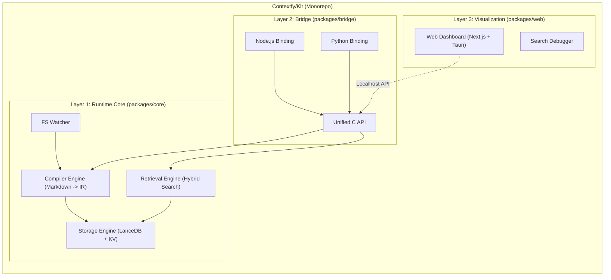

# Contextfy/Kit 产品需求文档 (PRD)

| **属性** | **内容** |
| --- | --- |
| **项目名称** | Contextfy/Kit |
| **版本号** | v1.0.0 (Draft) |
| **最后更新** | 2026-01-19 |
| **核心定位** | 高性能 AI 上下文编排引擎 (High-Performance Context Orchestration Engine) |
| **涉及组件** | `packages/core` (Rust), `packages/web` (Dashboard), `packages/bridge` (FFI) |

---

## 1. 产品愿景 (Vision)

“Context as Code.”

Contextfy/Kit 旨在解决 AI Agent 在垂直领域开发中面临的“知识断层”与“黑盒检索”问题。我们将非结构化的技术文档（Markdown, API Docs）编译为标准化的、可分发的、AI 原生的Context Pack（上下文包），并提供一套高性能的运行时环境（Runtime）供上层应用（CLI, MCP Server）调用。

---

## 2. 核心痛点与解决方案 (Problem & Solution)

| **痛点 (Pain Point)** | **根本原因** | **Contextfy/Kit 解决方案** |
| --- | --- | --- |
| **检索黑盒化** | 开发者无法理解为何 AI 检索到了错误的文档，无法优化 Context。 | **可观测性 (Observability):** 提供 Web UI 仪表盘，可视化展示向量匹配度、关键词命中率和热力图。 |
| **Context 污染** | 传统 RAG 一次性注入过多无关信息，导致 AI 注意力分散。 | **两阶段检索 (Two-Stage Retrieval):** 强制实现 Scout (侦察) -> Inspect (检视) 流程，按需加载精准切片。 |
| **知识版本混乱** | 文档更新滞后于代码，或者 AI 混淆了不同版本的 API。 | **Context Pack:** 引入类似 Docker Image 的版本控制机制，锁定知识快照。 |
| **异构数据处理难** | 处理 Markdown、MDX、HTML 需要编写大量重复的胶水代码。 | **统一编译管线:** 内置标准化的 Ingestion Pipeline，将异构源编译为统一的中间表示 (IR)。 |

---

## 3. 系统架构 (System Architecture)

Contextfy/Kit 采用 Monorepo 结构，强制实现**核心逻辑与交互层分离**。



---

## 4. 核心功能规范 (Functional Specifications)

### 4.1 `packages/core`: 核心引擎 (Rust)

这是项目的心脏，负责所有重逻辑。

### F1. Context Pack 编译管线 (The Compiler)

- **输入:** 本地目录路径（包含 Markdown/MDX）。
- **处理流程:**
    1. **Parsing:** 使用 `pulldown-cmark` 解析 AST。
    2. **Slicing:** 根据 Header 层级进行语义切片。
    3. **Summarization:** 提取每个 Section 的前 200 字符作为摘要（用于 Scout 阶段）。
    4. **Vectorization:** 调用嵌入模型（本地/API）生成向量。
- **输出:** 生成 `.ctxpack` 目录（包含 LanceDB 文件和 manifest.json）。
- **特性:** 支持**增量编译** (Incremental Build)，基于文件 Hash 跳过未变更的章节。

### F2. 双阶段检索原语 (Retrieval Primitives)

必须暴露以下两个底层 API：

- **`scout(query: string, limit: int) -> Vec<Brief>`**
    - **行为:** 仅在“摘要索引”中进行混合检索 (BM25 + Vector)。
    - **返回:** 文档 ID、标题、摘要、相关度评分。
    - **延迟目标:** < 20ms。
- **`inspect(ids: Vec<String>) -> Vec<Details>`**
    - **行为:** 根据 ID 读取完整内容。
    - **上下文剪枝:** 运行时根据原始 Query 对完整内容进行二次打分，高亮核心段落，折叠无关代码块。

### F3. 数据隔离 (Isolation)

- 支持 **Namespace** 概念。允许同时加载多个 Packs（例如 `fabric-1.21` 和 `java-std-lib`），互不干扰。

### 4.2 `packages/web`: 可视化与调试 (Web Stack)

这是产品的“控制台”，用于管理知识库和调试检索效果。

### F4. 知识库管理 (Library Manager)

- **Pack 列表:** 展示已安装的 Context Packs，显示版本、大小、最后编译时间。
- **操作:** 提供 `Rebuild`, `Delete`, `Update` 按钮。

### F5. 检索调试器 (Retrieval Debugger) - **核心亮点**

- **Playground:** 提供一个模拟的 Chat 界面，用户输入 Query。
- **X-Ray 面板:**
    - 展示 `Scout` 阶段返回的 Top 10 结果。
    - **Score Breakdown:** 显示为什么这个文档排第一（例如：关键词 'Fireball' 权重 0.7 + 向量相似度 0.8）。
    - **对比视图:** 允许用户点击“如果我用这个 Query 会搜到什么”，帮助用户优化 Prompt 或文档关键词。

### F6. 文档图谱 (Knowledge Graph)

- 利用 D3.js 或 Cytoscape.js 可视化文档间的引用关系。
- **用途:** 帮助开发者发现“孤岛文档”（没有任何链接指向的文档，AI 很难通过关联找到它）。

### 4.3 `packages/bridge`: 胶水层

### F7. FFI Bindings

- 利用 `napi-rs` 生成 Node.js 绑定（供 Contextfy/CLI 使用）。
- 利用 `PyO3` 生成 Python 绑定（供 Contextfy/MCP 使用）。
- **目标:** 确保上层应用调用 Core 时无序列化性能损耗。

---

## 5. 数据结构设计 (Data Model)

### 5.1 The Context Pack Manifest (`contextfy.json`)

类似于 `package.json`，定义知识包的元数据。

```json
{
  "name": "fabric-wiki",
  "version": "1.21.0-beta",
  "description": "Official documentation for Fabric MC 1.21",
  "sources": [
    {
      "root": "./docs",
      "include": ["**/*.md"],
      "strategy": "guide"
    }
  ],
  "indexing": {
    "embedding_model": "fastembed-bge-small-en"
  }
}
```

### 5.2 存储 Schema (LanceDB)

**Table: `knowledge_index`**

| **Field** | **Type** | **Description** | **Usage** |
| --- | --- | --- | --- |
| `id` | UUID | Primary Key | Internal |
| `pack_id` | String | Namespace (e.g., "fabric-1.21") | Isolation |
| `title` | String | Section Title | Scout / Display |
| `summary` | String | First paragraph / Auto-summary | **Scout Search Target** |
| `keywords` | List<Str> | Extracted entities (APIs) | **BM25 Search Target** |
| `content` | Blob | Full Markdown content (Compressed) | Inspect Return |
| `vector` | Float32[] | Embedding of (Title + Summary) | Vector Search |

---

## 6. 用户交互流 (User Interaction Flow)

### 场景：开发者配置新知识库并调试

1. **Init:** 用户在文档目录运行 `contextfy init`，生成 `contextfy.json`。
2. **Build:** 运行 `contextfy build`。Core 引擎启动，编译文档，生成 `.ctxpack`。
3. **Inspect:** 用户运行 `contextfy ui`，浏览器打开 Dashboard。
4. **Debug:**
    - 用户在 Dashboard 输入测试问题：“怎么创建方块？”
    - 观察 X-Ray 面板，发现相关的文档排名靠后。
    - 用户发现是因为文档里用了 "Block Registration" 而非 "Create Block"。
    - 用户修改文档或在 `contextfy.json` 中添加手动 alias 关键词。
    - 点击 Rebuild，再次测试，排名上升。
5. **Serve:** 调试完毕，用户运行 `contextfy mcp serve`，AI Agent 开始使用优化后的知识库。

---

## 7. 演进路线图 (Roadmap)

### Phase 1: Foundation (v0.1)

- [Core] 实现 Markdown 解析与 LanceDB 存储。
- [Core] 实现 `scout` (仅向量) 和 `inspect` 接口。
- [CLI] 支持 `build` 命令生成索引。

### Phase 2: Observability (v0.5)

- [Web] 搭建 Next.js + Tauri 框架。
- [Web] 实现基础的 Search Playground 和 X-Ray 面板。
- [Core] 引入 BM25 算法实现混合检索。

### Phase 3: Ecosystem (v1.0)

- [Bridge] 发布稳定的 Node.js 和 Python 绑定。
- [Feature] 支持 Context Pack 的导入导出（单文件分发）。
- [UI] 完整的知识图谱可视化。

---

## 8. 验收标准 (Success Metrics)

1. **性能指标:** 100MB 纯文本知识库，`scout` 接口响应时间 < 50ms。
2. **准确性指标:** 在测试集（Test Set）中，Top-3 召回率达到 90% 以上。
3. **开发体验:** 从 `contextfy init` 到 AI 可调用的时间 < 5 分钟。

---
