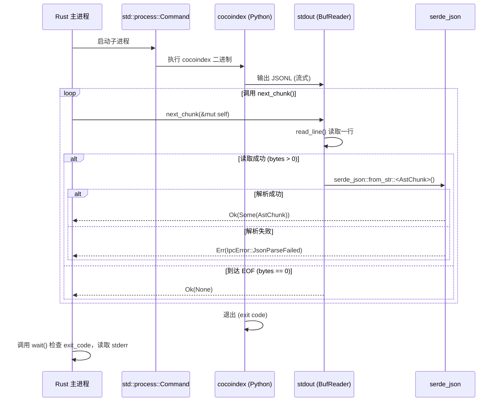

# Design: IPC 流式解析器技术设计

## Context

Contextfy/Kit 需要集成 Python 生态的 AST 解析工具（如 `cocoindex`）以处理 Python 代码库。由于 Rust 生态缺乏成熟的等价工具，我们需要建立跨语言通信管道。

**技术约束**：
- Rust 主进程不能直接调用 Python 代码（FFI 复杂度高）
- Python 工具输出为 JSONL 格式（每行一个 JSON 对象）
- 大型代码库的 AST 输出可能达到数百 MB，必须流式处理

**利益相关者**：
- 编译管线（`compiler` 模块）：未来的调用方
- 存储层（`storage` 模块）：接收解析后的 `AstChunk` 数据

## Goals / Non-Goals

### Goals
- ✅ 建立零拷贝（或低拷贝）的 stdout 流式读取管道
- ✅ 提供类型安全的 `AstChunk` 反序列化
- ✅ 实现 Panic Safe 的错误处理（捕获子进程崩溃）
- ✅ 支持开发态的 `uv run` 和生产态的二进制调用两种模式

### Non-Goals
- ❌ 本次不实现与 Markdown 解析器的集成（未来工作）
- ❌ 不实现增量解析或缓存策略（未来可优化）
- ❌ 不实现 Python 环境管理（假设 `cocoindex` 已安装）

## Decisions

### Decision 1: 使用 JSONL 而非 JSON Array

**选择**：使用 JSONL（JSON Lines）格式，每行一个独立的 JSON 对象。

**理由**：
- **流式友好**：可以在读取到 `\n` 时立即解析，无需等待完整输出
- **内存可控**：BufReader 按行读取，内存占用仅与单条记录相关
- **错误隔离**：单行解析失败不会影响其他行

**Alternatives considered**:
- **JSON Array**：需要等待完整输出才能反序列化，不适用于大型数据集
- **Protobuf/MessagePack**：二进制格式虽更高效，但 Python 工具需改造，违背"复用现有工具"原则

### Decision 2: 使用 `std::process::Command` 而非 Tokio `process`

**选择**：使用同步的 `std::process::Command` + `BufReader`。

**理由**：
- **简单性**：同步代码更易理解和调试
- **足够性能**： stdout 读取是 I/O 密集型，Tokio 异步优势不明显
- **错误处理**：同步代码的 `?` 传播更直观

**Alternatives considered**:
- **Tokio `process::Command`**：增加复杂度，但在高并发场景下可能更优（暂不需要）

### Decision 3: 错误处理策略

**选择**：使用 `anyhow::Error` + `.context()` 提供上下文，禁止 `unwrap()`。

**错误分类**：

```rust
#[derive(Debug)]
pub enum IpcError {
    ChildStartFailed { command: String, cause: String },
    StreamReadFailed { cause: String },
    JsonParseFailed { line_number: usize, raw_line: String, cause: String },
    ChildExitedAbnormally { exit_code: Option<i32>, stderr: String },
}
```


**Alternatives considered**:
- **直接 `panic!`**：违背"Panic Safe"原则，会导致主进程崩溃
- **仅返回 `String`**：丢失结构化错误信息，不利于诊断

### Decision 4: API 设计 - 避免 `impl Iterator` 生命周期陷阱

**选择**：使用 `next_chunk(&mut self) -> anyhow::Result<Option<AstChunk>>` 而非返回迭代器。

**API 签名**：
```rust
impl SidecarIPC {
    /// 读取下一行 JSONL 并反序列化为 AstChunk
    /// 返回 Ok(Some(chunk)) 成功读取
    /// 返回 Ok(None) 到达 EOF
    /// 返回 Err(...) 发生错误（IO 错误、JSON 解析失败、子进程崩溃）
    pub fn next_chunk(&mut self) -> anyhow::Result<Option<AstChunk>> {
        let mut line = String::new();
        let bytes_read = self.stdout.read_line(&mut line)?;

        if bytes_read == 0 {
            return Ok(None); // EOF
        }

        let chunk: AstChunk = serde_json::from_str(&line)
            .with_context(|| format!("Failed to parse JSONL: {}", line))?;

        Ok(Some(chunk))
    }
}
```

**使用模式**：
```rust
let mut ipc = SidecarIPC::spawn(...)?;
while let Ok(Some(chunk)) = ipc.next_chunk() {
    // 处理 chunk
}
// 检查子进程退出状态
ipc.wait()?;
```

**理由**：
- **避免生命周期地狱**：`BufReader` 被 `SidecarIPC` 拥有，返回 `impl Iterator` 会导致借用检查器报错（迭代器生命周期无法超过 `self`）
- **调用模式简洁**：`while let Ok(Some(chunk)) = ipc.next_chunk()` 非常直观
- **错误处理明确**：每次调用返回 `Result`，立即传播错误
- **符合 Rust 惯例**：类似 `std::io::BufRead::read_line` 的设计

**Alternatives considered**:
- **返回 `impl Iterator`**：❌ 生命周期冲突，`BufReader<ChildStdout>` 的 `lines()` 方法返回的迭代器借用 `self`，但 `self` 是 `SidecarIPC` 拥有的，无法返回独立生命周期的迭代器
- **实现 `Iterator` trait**：❌ 同样遇到 `&mut self` 借用问题，且需要维护迭代器状态
- **使用 `async` Stream**：❌ 引入不必要的复杂度（同步 I/O 已足够）


### Decision 5: 开发态 vs 生产态二进制发现

**选择**：通过环境变量 `COCOINDEX_MODE` 控制调用方式。

```rust
let cmd = if std::env::var("COCOINDEX_MODE").as_deref() == Ok("dev") {
    // 开发态：使用 uv run 跨 worktree 调用
    Command::new("uv").args(["run", "cocoindex", ...])
} else {
    // 生产态：直接调用二进制
    Command::new("cocoindex")
};
```


**理由**：
- **灵活性**：支持本地开发的热重载（uv run 自动管理虚拟环境）
- **性能**：生产态跳过 uv 启动开销

**Alternatives considered**:
- **硬编码路径**：缺乏灵活性，不同开发者路径不同
- **编译时特性开关**：需要重新编译才能切换模式，不友好

## Data Flow




## Risks / Trade-offs

### Risk 1: 子进程僵死（Zombie Process）


**描述**：Python 进程因内部错误卡住，永不退出，stdout 也不再输出。

**缓解措施**：
- 实现 **超时机制**：使用 `tokio::time::timeout` 包装读取逻辑（未来异步化后）
- 当前版本：依赖用户手动终止（可接受，因为首次版本）

### Risk 2: JSON Schema 不兼容

**描述**：`cocoindex` 输出格式变更，导致反序列化失败。

**缓解措施**：
- `AstChunk` 使用 `#[serde(default)]` 提供默认值
- 在 `JsonParseFailed` 错误中记录 `raw_line`，便于调试
- 未来：版本化契约（添加 `version` 字段）

### Risk 3: 内存碎片（Large String）

**描述**：`ast_content` 字段可能包含大块代码（如整个函数体），导致频繁的内存分配。

**缓解措施**：
- 使用 `String` 而非 `Vec<u8>`（Rust 的 String 已优化）
- 未来：使用 `Cow<'static, str>` 或引用计数（`Arc<str>`）

## Migration Plan

**Phase 1（本次变更）**：
1. 实现 `SidecarIPC` 基础设施
2. 编写单元测试（使用 `echo` 模拟）
3. 不集成到主流程

**Phase 2（未来）**：
1. 在 `compiler` 模块中调用 `SidecarIPC`
2. 将 `AstChunk` 转换为 `KnowledgeRecord`
3. 写入存储层

**Rollback**：
- 删除 `packages/core/src/parser/ipc.rs` 即可回滚
- 移除 `AstChunk` 定义（如果未被使用）

## Open Questions

1. **Q**: `cocoindex` 输出的 JSONL 字段是否最终确定？
   **A**: 假设已稳定，如有变更需更新 `AstChunk` 结构体。

2. **Q**: 是否需要支持并发调用多个 `SidecarIPC` 实例？
   **A**: 暂不需要，单文件顺序解析已满足需求。未来可考虑并行处理多个文件。

3. **Q**: 错误时是否应该自动重试？
   **A**: 否。子进程崩溃通常是可重现的错误（如语法错误的 Python 文件），重试无意义。由调用方决定是否重试。
